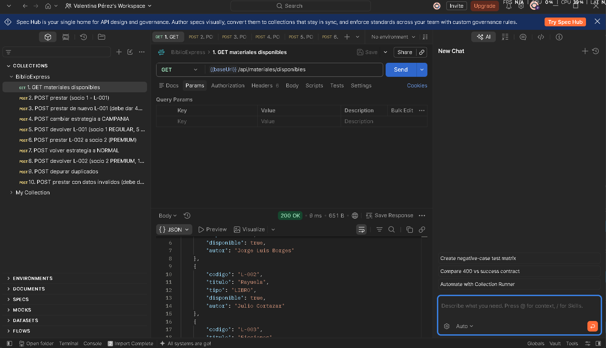
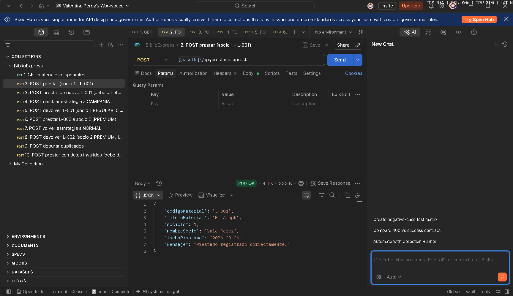
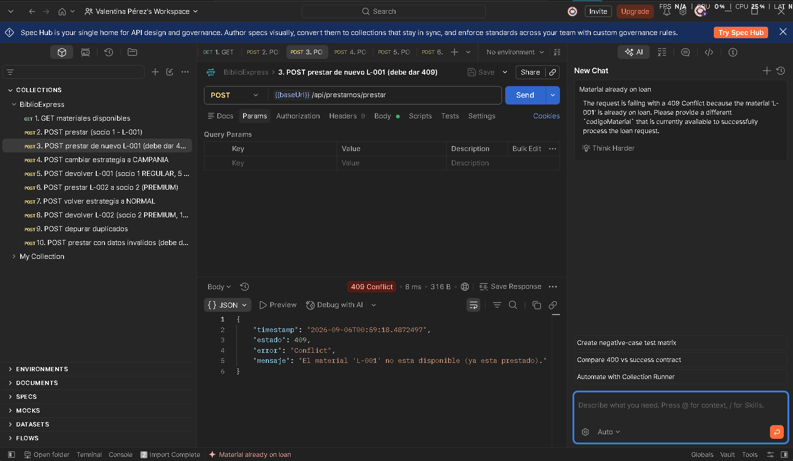
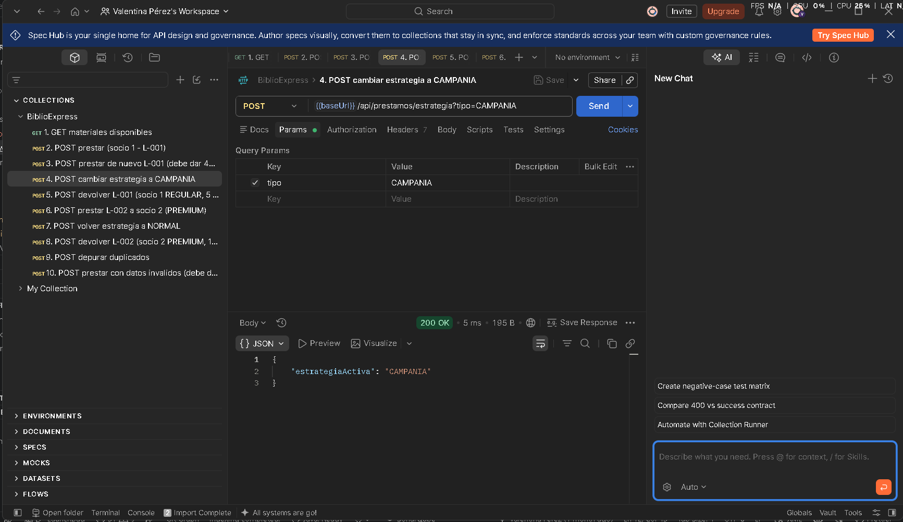
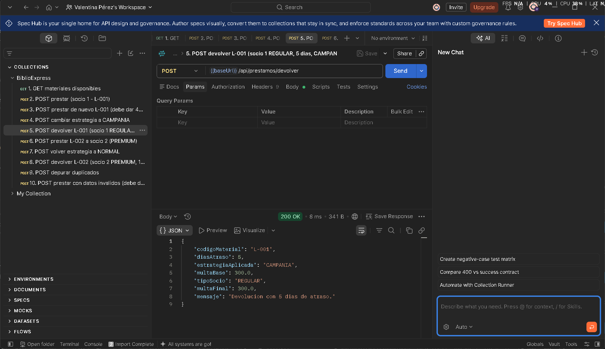
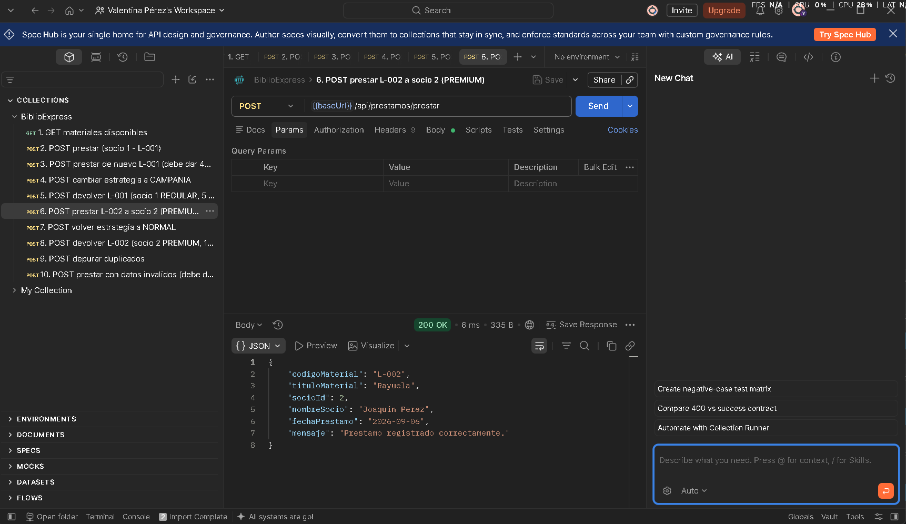
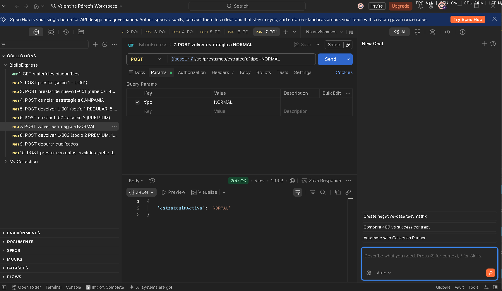
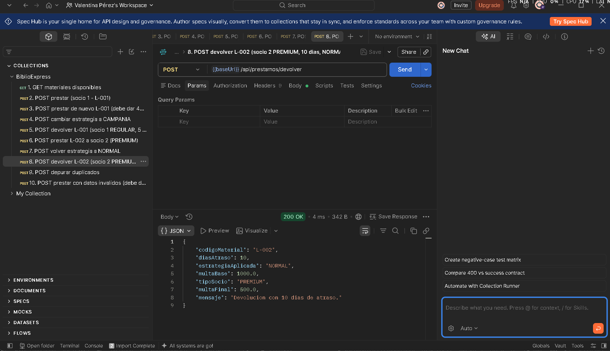
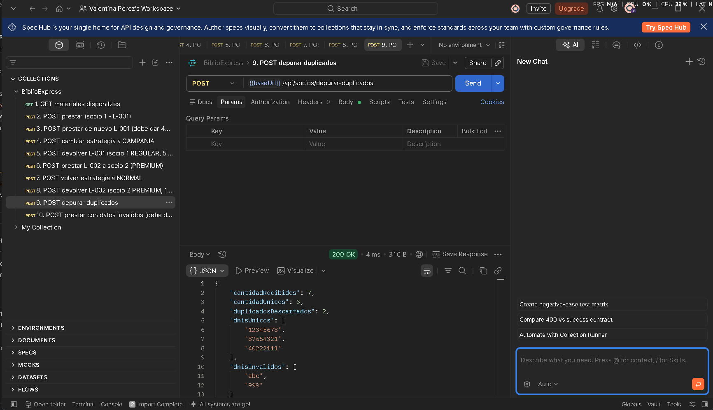
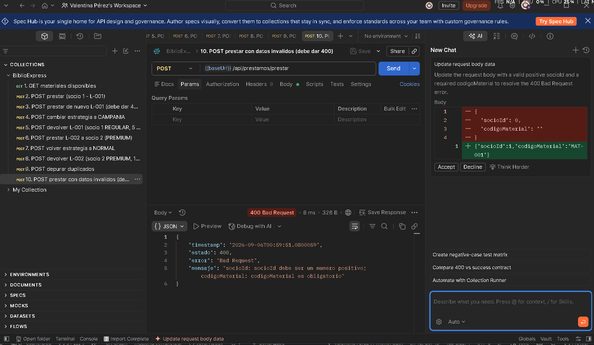

# EVIDENCIAS - BiblioExpress

Capturas de las pruebas hechas con Postman (colección `BiblioExpress.postman_collection.json`).

> Cómo sacar cada captura: en Postman, después de apretar **Send**, recortá la pantalla
> con `Win + Shift + S` (que se vea el nombre de la prueba, el código de estado y el
> cuerpo de la respuesta). Guardá la imagen en la carpeta `evidencias/` con el nombre
> que indica cada sección.

---

## 1. GET /api/materiales/disponibles

Lista los 5 materiales, todos `disponible: true`.

---

## 2. POST /api/prestamos/prestar

Body: `{ "socioId": 1, "codigoMaterial": "L-001" }`
Resultado: **200 OK**, `"mensaje": "Prestamo registrado correctamente."`

---

## 3. POST /api/prestamos/prestar (material ya prestado)

Body: `{ "socioId": 2, "codigoMaterial": "L-001" }`
Resultado: **409 Conflict**, `"El material 'L-001' no esta disponible (ya esta prestado)."`

---

## 4. POST /api/prestamos/estrategia?tipo=CAMPANIA

Resultado: **200 OK**, `{ "estrategiaActiva": "CAMPANIA" }`

---

## 5. POST /api/prestamos/devolver (socio REGULAR, estrategia CAMPANIA)

Body: `{ "socioId": 1, "codigoMaterial": "L-001", "diasAtraso": 5 }`
Resultado: **200 OK**, `multaBase: 300` (5 × 60), `tipoSocio: REGULAR`, `multaFinal: 300`.

---

## 6. POST /api/prestamos/prestar (socio PREMIUM)

Body: `{ "socioId": 2, "codigoMaterial": "L-002" }`
Resultado: **200 OK**, préstamo a "Joaquin Perez".

---

## 7. POST /api/prestamos/estrategia?tipo=NORMAL

Resultado: **200 OK**, `{ "estrategiaActiva": "NORMAL" }`

---

## 8. POST /api/prestamos/devolver (socio PREMIUM, estrategia NORMAL)

Body: `{ "socioId": 2, "codigoMaterial": "L-002", "diasAtraso": 10 }`
Resultado: **200 OK**, `multaBase: 1000` (10 × 100), `tipoSocio: PREMIUM`,
`multaFinal: 500` (50 % de descuento).

---

## 9. POST /api/socios/depurar-duplicados

Body: `{ "dnis": ["12345678","12345678","87654321","abc","999","40222111","87654321"] }`
Resultado: **200 OK**, `cantidadRecibidos: 7`, `cantidadUnicos: 3`,
`duplicadosDescartados: 2`, `dnisInvalidos: ["abc","999"]`.

---

## 10. POST /api/prestamos/prestar con datos inválidos

Body: `{ "socioId": 0, "codigoMaterial": "" }`
Resultado: **400 Bad Request** con el detalle de los campos que fallaron.

